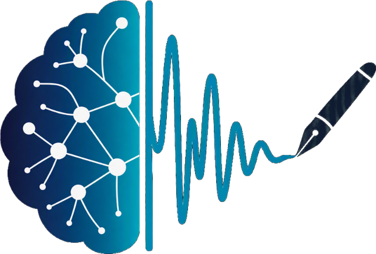

# Awesome EEG Software 

  <picture>
    <source media="(prefers-color-scheme: dark)" srcset="media/symbol-dark.png">
    
  </picture>

> A curated, verified list of open-source software for reading, preprocessing, analyzing, decoding, and acquiring EEG — from MATLAB classics like EEGLAB, FieldTrip, and Brainstorm to the MNE-Python ecosystem, BCI/deep-learning libraries, open hardware, and sleep/clinical tooling — plus verified public datasets for EEG, ECoG/sEEG, MEG, fNIRS, and human single-neuron electrophysiology.

**Inclusion bar:** every entry must contain **meaningful code** and be either **novel** (a capability no other entry provides) or **exceptionally well engineered** (tests, CI, docs, packaging, active maintenance). Each repository was checked against the GitHub/GitLab APIs for source size, tests, CI, commits in the last 12 months, and license file. Maintained entries that fall short in a specific way carry an italic note; inactive or unlicensed projects that are still worth knowing about are listed in a separate file linked from the footnotes. Datasets are listed separately and labeled as data, not code.

Licenses matter here: several major MATLAB toolboxes are **GPL**, so read the licensing notes before you vendor code into your own project.

**New to EEG?** Every term and acronym used here is defined in both technical and plain language in the glossary.

**Search and filter this list:** [core-creates.github.io/awesome-eeg-software](https://core-creates.github.io/awesome-eeg-software/), a searchable view built live from this README.

**Last verified:** 2026-10-03

## Contents

- [Choosing a stack](#choosing-a-stack)
- [Core platforms](#core-platforms)
- [EEGLAB plugins and MATLAB pipelines](#eeglab-plugins-and-matlab-pipelines)
- [MNE-Python ecosystem](#mne-python-ecosystem)
- [Preprocessing and artifact handling](#preprocessing-and-artifact-handling)
- [Spectral, oscillation, and feature analysis](#spectral-oscillation-and-feature-analysis)
- [Connectivity, microstates, and hyperscanning](#connectivity-microstates-and-hyperscanning)
- [Regression, encoding models, and simulation](#regression-encoding-models-and-simulation)
- [Source localization](#source-localization)
- [BCI, machine learning, and deep learning](#bci-machine-learning-and-deep-learning)
- [Sleep and clinical EEG](#sleep-and-clinical-eeg)
- [Acquisition, hardware, and real-time streaming](#acquisition-hardware-and-real-time-streaming)
- [File formats, viewers, and I/O](#file-formats-viewers-and-io)
- [R and Julia](#r-and-julia)
- [Data standards and platforms](#data-standards-and-platforms)
- [Datasets (data, not code)](#datasets-data-not-code)
  - [Scalp EEG](#scalp-eeg)
  - [Sleep and polysomnography](#sleep-and-polysomnography)
  - [Intracranial EEG: ECoG and sEEG](#intracranial-eeg-ecog-and-seeg)
  - [MEG and simultaneous MEG/EEG](#meg-and-simultaneous-megeeg)
  - [fNIRS and hybrid EEG-fNIRS](#fnirs-and-hybrid-eeg-fnirs)
  - [HEG (hemoencephalography)](#heg-hemoencephalography)
  - [Human single-neuron and microelectrode electrophysiology](#human-single-neuron-and-microelectrode-electrophysiology)
- [Licensing notes](#licensing-notes)
- [Appendix: Glossary](#appendix-glossary)
  - [Recording modalities](#recording-modalities)
  - [Recording setup and hardware](#recording-setup-and-hardware)
  - [Signals, waves, and events](#signals-waves-and-events)
  - [Preprocessing and artifacts](#preprocessing-and-artifacts)
  - [Analysis and statistics](#analysis-and-statistics)
  - [Source localization terms](#source-localization-terms)
  - [BCI and machine learning terms](#bci-and-machine-learning-terms)
  - [Sleep and clinical terms](#sleep-and-clinical-terms)
  - [Data formats, standards, and repositories](#data-formats-standards-and-repositories)
  - [Licensing, privacy, and research governance](#licensing-privacy-and-research-governance)
  - [Software and computing terms](#software-and-computing-terms)
  - [Acronym quick reference](#acronym-quick-reference)

## Choosing a stack

| Goal                                               | Recommended starting point                                 |
| -------------------------------------------------- | ---------------------------------------------------------- |
| ERP / cognitive study, GUI-first                   | EEGLAB + ICLabel + ERPLAB                                  |
| Free, scriptable, reproducible pipeline            | MNE-Python + MNE-BIDS-Pipeline + autoreject + mne-icalabel |
| Source imaging with a GUI                          | Brainstorm                                                 |
| Beamformers, connectivity, cluster stats in MATLAB | FieldTrip                                                  |
| Oscillations: aperiodic, bursts, cycles            | specparam, NeuroDSP, bycycle                               |
| Microstates or two-brain (hyperscanning) studies   | Pycrostates, HyPyP                                         |
| Overlapping ERPs, continuous speech/TRFs           | Unfold.jl, Eelbrain                                        |
| BCI / decoding / deep learning / foundation models | MNE + Braindecode, MOABB, pyRiemann                        |
| Sleep staging and microstructure                   | MNE + YASA, or Luna for large cohorts                      |
| Infant / high-artifact data                        | HAPPE, RELAX, or Automagic                                 |
| OpenBCI, Muse, Mentalab, other headsets            | OpenBCI GUI, BrainFlow, LSL, device SDKs → MNE             |

## Core platforms

| Project                                                       | Language      | License                           | Description                                                                                                                                                                                                                                                              |
| ------------------------------------------------------------- | ------------- | --------------------------------- | ------------------------------------------------------------------------------------------------------------------------------------------------------------------------------------------------------------------------------------------------------------------------ |
| [EEGLAB](https://github.com/sccn/eeglab)                      | MATLAB        | BSD-2-Clause (core; plugins vary) | Interactive EEG/MEG toolbox from SCCN (UCSD). ICA-centric workflow, GUI with full script history, STUDY group analysis, huge plugin ecosystem. [Docs](https://eeglab.org)                                                                                                |
| [MNE-Python](https://github.com/mne-tools/mne-python)         | Python        | BSD-3-Clause                      | Full MEG/EEG/sEEG/ECoG/fNIRS library: `Raw` → `Epochs` → `Evoked`, ICA, time-frequency, source imaging, cluster statistics, scikit-learn decoding. Exports EEGLAB files via the small [eeglabio](https://github.com/jackz314/eeglabio) helper. [Docs](https://mne.tools) |
| [Brainstorm](https://github.com/brainstorm-tools/brainstorm3) | MATLAB / Java | GPL-3.0                           | GUI-driven MEG/EEG/fNIRS/ECoG/sEEG application with a strong focus on source imaging. A compiled standalone runs without a MATLAB license. [Docs](https://neuroimage.usc.edu/brainstorm/)                                                                                |
| [FieldTrip](https://github.com/fieldtrip/fieldtrip)           | MATLAB        | GPL-3.0                           | Script-based MEG/EEG/iEEG toolbox (Donders Institute). Beamformers, frequency analysis, connectivity, nonparametric cluster-based statistics. [Docs](https://www.fieldtriptoolbox.org)                                                                                   |
| [SPM](https://github.com/spm/spm)                             | MATLAB        | GPL-2.0                           | Statistical Parametric Mapping. Its M/EEG module provides Bayesian source reconstruction and Dynamic Causal Modelling (DCM).                                                                                                                                             |
| [OpenViBE](https://gitlab.inria.fr/openvibe/openvibe)         | C++           | AGPL-3.0                          | Real-time BCI platform (Inria) with a visual "box" designer for acquisition, processing, and online classification. Hosted on Inria GitLab. [Site](https://openvibe.inria.fr/)                                                                                           |

## EEGLAB plugins and MATLAB pipelines

| Project                                                    | License      | Description                                                                                                             |
| ---------------------------------------------------------- | ------------ | ----------------------------------------------------------------------------------------------------------------------- |
| [ICLabel](https://github.com/sccn/ICLabel)                 | BSD-2-Clause | Automatic classification of independent components (brain, eye, muscle, heart, line noise, channel noise, other).       |
| [clean_rawdata](https://github.com/sccn/clean_rawdata)     | GPL-3.0      | Artifact Subspace Reconstruction (ASR) and bad-channel/flatline detection for continuous data.                          |
| [ERPLAB](https://github.com/ucdavis/erplab)                | GPL-3.0      | ERP-focused processing, measurement, and statistics, tightly integrated with EEGLAB.                                    |
| [LIMO EEG](https://github.com/LIMO-EEG-Toolbox/limo_tools) | MIT          | Hierarchical linear modelling of M/EEG data across all time points and channels.                                        |
| [HAPPE](https://github.com/PINE-Lab/HAPPE)                 | GPL-3.0      | Harvard Automated Processing Pipeline for EEG. Built for high-artifact and developmental/infant data. *No tests or CI.* |
| [RELAX](https://github.com/NeilwBailey/RELAX)              | GPL-3.0      | Automated cleaning pipeline combining multi-channel Wiener filtering with wavelet-enhanced ICA. *No tests or CI.*       |
| [Automagic](https://github.com/methlabUZH/automagic)       | GPL-3.0      | Automated preprocessing and quality rating of large EEG datasets. *No tests or CI; last release v3.0 (2023).*           |

## MNE-Python ecosystem

| Project                                                             | License      | Description                                                       |
| ------------------------------------------------------------------- | ------------ | ----------------------------------------------------------------- |
| [MNE-BIDS](https://github.com/mne-tools/mne-bids)                   | BSD-3-Clause | Read and write BIDS-compatible datasets with MNE.                 |
| [MNE-BIDS-Pipeline](https://github.com/mne-tools/mne-bids-pipeline) | BSD-3-Clause | Configurable, fully automated processing of entire BIDS datasets. |
| [mne-icalabel](https://github.com/mne-tools/mne-icalabel)           | BSD-3-Clause | Python port of ICLabel for automatic ICA component labelling.     |
| [mne-connectivity](https://github.com/mne-tools/mne-connectivity)   | BSD-3-Clause | Spectral and time-resolved connectivity estimators.               |
| [mne-features](https://github.com/mne-tools/mne-features)           | BSD-3-Clause | Feature extraction from multivariate time series for ML.          |
| [mne-qt-browser](https://github.com/mne-tools/mne-qt-browser)       | BSD-3-Clause | Fast Qt-based 2D data browser backend for MNE.                    |
| [mne-nirs](https://github.com/mne-tools/mne-nirs)                   | BSD-3-Clause | fNIRS processing; useful for combined EEG-fNIRS studies.          |
| [MNELAB](https://github.com/cbrnr/mnelab)                           | BSD-3-Clause | Point-and-click GUI on top of MNE-Python.                         |

## Preprocessing and artifact handling

| Project                                                | Language | License      | Description                                                                |
| ------------------------------------------------------ | -------- | ------------ | -------------------------------------------------------------------------- |
| [autoreject](https://github.com/autoreject/autoreject) | Python   | BSD-3-Clause | Automated, cross-validated rejection and repair of bad epochs and sensors. |
| [PyPREP](https://github.com/sappelhoff/pyprep)         | Python   | MIT          | Python implementation of the PREP pipeline.                                |
| [MEEGkit](https://github.com/nbara/python-meegkit)     | Python   | BSD-3-Clause | Denoising toolkit: ASR, DSS, ZapLine line-noise removal, STAR, TRCA.       |

## Spectral, oscillation, and feature analysis

| Project                                                   | Language | License      | Description                                                                                                                         |
| --------------------------------------------------------- | -------- | ------------ | ----------------------------------------------------------------------------------------------------------------------------------- |
| [specparam (FOOOF)](https://github.com/fooof-tools/fooof) | Python   | Apache-2.0   | Parameterizes power spectra into periodic (oscillatory) and aperiodic (1/f) components. [Docs](https://specparam-tools.github.io)   |
| [NeuroDSP](https://github.com/neurodsp-tools/neurodsp)    | Python   | Apache-2.0   | Neural signal processing: filtering, burst detection, time-frequency, rhythmicity, and simulation of periodic/aperiodic signals.    |
| [bycycle](https://github.com/bycycle-tools/bycycle)       | Python   | Apache-2.0   | Cycle-by-cycle analysis of oscillations: waveform shape, amplitude, period, and burst detection in the time domain.                 |
| [AntroPy](https://github.com/raphaelvallat/antropy)       | Python   | BSD-3-Clause | Fast entropy and complexity measures (permutation, spectral, sample entropy; fractal dimensions; DFA).                              |
| [NeuroKit2](https://github.com/neuropsychology/NeuroKit)  | Python   | MIT          | General neurophysiological signal processing (ECG, EDA, EMG, RSP, EEG) and complexity measures. *EEG is a minor part of its scope.* |
| [Wonambi](https://github.com/wonambi-python/wonambi)      | Python   | BSD-3-Clause | Visualization and analysis of EEG/ECoG, including sleep scoring and event detection.                                                |

## Connectivity, microstates, and hyperscanning

| Project                                                                           | Language | License      | Description                                                                                                                              |
| --------------------------------------------------------------------------------- | -------- | ------------ | ---------------------------------------------------------------------------------------------------------------------------------------- |
| [Pycrostates](https://github.com/vferat/pycrostates)                              | Python   | BSD-3-Clause | EEG microstate analysis (clustering, segmentation, back-fitting, metrics), built on MNE.                                                 |
| [HyPyP](https://github.com/ppsp-team/HyPyP)                                       | Python   | BSD-3-Clause | Hyperscanning pipeline for inter-brain synchrony and connectivity across simultaneously recorded participants.                           |
| [Frites](https://github.com/brainets/frites)                                      | Python   | BSD-3-Clause | Information-theoretic (Gaussian-copula mutual information) analysis of electrophysiology with group-level, cluster-corrected statistics. |
| [Spectral Connectivity](https://github.com/Eden-Kramer-Lab/spectral_connectivity) | Python   | GPL-3.0      | Multitaper spectral and connectivity measures (coherence, Granger, PLV, …) with optional GPU acceleration.                               |
| [conpy](https://github.com/AaltoImagingLanguage/conpy)                            | Python   | BSD-3-Clause | All-to-all source-space connectivity using DICS beamforming, built on MNE.                                                               |
| [bctpy](https://github.com/aestrivex/bctpy)                                       | Python   | GPL-3.0      | Python port of the Brain Connectivity Toolbox: graph-theoretical measures on connectivity matrices.                                      |

## Regression, encoding models, and simulation

| Project                                                 | Language | License      | Description                                                                                                                                                                              |
| ------------------------------------------------------- | -------- | ------------ | ---------------------------------------------------------------------------------------------------------------------------------------------------------------------------------------- |
| [Unfold.jl](https://github.com/unfoldtoolbox/Unfold.jl) | Julia    | MIT          | Regression-based ERP analysis with deconvolution of overlapping responses, mixed models, and splines. Successor to the MATLAB [unfold](https://github.com/unfoldtoolbox/unfold) toolbox. |
| [Eelbrain](https://github.com/Eelbrain/Eelbrain)        | Python   | BSD-3-Clause | Temporal response functions (boosting) for continuous stimuli such as speech, plus mass-univariate statistics on M/EEG.                                                                  |

## Source localization

Most source-imaging work happens in the core platforms. Use **Brainstorm** for a GUI, **MNE-Python** for scripted distributed/beamformer methods, **FieldTrip** for beamformers in MATLAB, **SPM** for Bayesian/DCM, and EEGLAB's DIPFIT for equivalent-dipole fitting of ICA components.

| Project                                          | Language              | License  | Description                                                                                                  |
| ------------------------------------------------ | --------------------- | -------- | ------------------------------------------------------------------------------------------------------------ |
| [OpenMEEG](https://github.com/openmeeg/openmeeg) | C++ (Python bindings) | CeCILL-B | Symmetric boundary-element (BEM) forward modelling for EEG/MEG/ECoG; used by Brainstorm, FieldTrip, and MNE. |

## BCI, machine learning, and deep learning

| Project                                                   | Language | License      | Description                                                                                                                                                                                                            |
| --------------------------------------------------------- | -------- | ------------ | ---------------------------------------------------------------------------------------------------------------------------------------------------------------------------------------------------------------------- |
| [Braindecode](https://github.com/braindecode/braindecode) | Python   | BSD-3-Clause | Deep learning for EEG/ECG/MEG in PyTorch. Ships tested implementations of EEGNet and of foundation models such as LaBraM, BIOT, EEGPT, CBraMod, BENDR, and U-Sleep, so prefer it over the original paper repositories. |
| [MOABB](https://github.com/NeuroTechX/moabb)              | Python   | BSD-3-Clause | Mother of All BCI Benchmarks: standardized evaluation across public BCI datasets.                                                                                                                                      |
| [pyRiemann](https://github.com/pyRiemann/pyRiemann)       | Python   | BSD-3-Clause | Riemannian-geometry ML on covariance matrices. A strong baseline for many BCI tasks.                                                                                                                                   |
| [BciPy](https://github.com/CAMBI-tech/BciPy)              | Python   | BSD-3-Clause | End-to-end BCI experiment framework (RSVP and matrix spellers): acquisition, stimulus presentation, signal models, and language models.                                                                                |
| [TorchEEG](https://github.com/torcheeg/torcheeg)          | Python   | MIT          | PyTorch datasets, transforms, and models for EEG. *Overlaps Braindecode; last release 2024-12.*                                                                                                                        |

## Sleep and clinical EEG

| Project                                       | Language                        | License      | Description                                                                                                                              |
| --------------------------------------------- | ------------------------------- | ------------ | ---------------------------------------------------------------------------------------------------------------------------------------- |
| [YASA](https://github.com/raphaelvallat/yasa) | Python                          | BSD-3-Clause | Automatic sleep staging, spindle and slow-wave detection, and bandpower for polysomnography.                                             |
| [Luna](https://github.com/remnrem/luna-base)  | C/C++ (R and Python interfaces) | GPL-3.0      | High-performance toolset for large-scale sleep EEG/PSG studies: artifact handling, spectral analysis, spindle/SO detection, and staging. |
| [SleepECG](https://github.com/cbrnr/sleepecg) | Python                          | BSD-3-Clause | Sleep stage detection from ECG; complements EEG-based staging. *ECG, not EEG.*                                                           |

For clinical and sleep **datasets** (HEEDB, TUH, CHB-MIT, Sleep-EDF), see Datasets.

## Acquisition, hardware, and real-time streaming

| Project                                                                    | Language                                          | License      | Description                                                                                                                                                                                                                                    |
| -------------------------------------------------------------------------- | ------------------------------------------------- | ------------ | ---------------------------------------------------------------------------------------------------------------------------------------------------------------------------------------------------------------------------------------------- |
| [BrainFlow](https://github.com/brainflow-dev/brainflow)                    | C++ (+ Python, Java, C#, R, Julia, Rust bindings) | MIT          | Unified SDK for many research and consumer biosensor boards (OpenBCI, Muse, and more).                                                                                                                                                         |
| [Lab Streaming Layer (liblsl)](https://github.com/sccn/liblsl)             | C++                                               | MIT          | The de facto standard for time-synchronized streaming of EEG, markers, and other sensors. Python bindings: [pylsl](https://github.com/labstreaminglayer/pylsl). Apps and docs: [labstreaminglayer](https://github.com/sccn/labstreaminglayer). |
| [MNE-LSL](https://github.com/mne-tools/mne-lsl)                            | Python                                            | BSD-3-Clause | Real-time streaming and processing with MNE-Python on top of LSL.                                                                                                                                                                              |
| [OpenBCI GUI](https://github.com/OpenBCI/OpenBCI_GUI)                      | Processing / Java                                 | MIT          | Official OpenBCI desktop app for Cyton and Ganglion boards: live visualization, recording, filtering, and LSL/UDP/OSC networking (uses BrainFlow). *No commits on the default branch in 12 months; last push 2026-04.*                         |
| [OpenBCI board firmware](https://github.com/OpenBCI/OpenBCI_Cyton_Library) | C++                                               | MIT          | Firmware for the open-hardware Cyton (ADS1299) board; see also the [Ganglion library](https://github.com/OpenBCI/OpenBCI_Ganglion_Library). *Firmware; no tests or CI.*                                                                        |
| [muse-lsl](https://github.com/alexandrebarachant/muse-lsl)                 | Python                                            | BSD-3-Clause | Stream, record, and visualize data from Interaxon Muse headsets over LSL.                                                                                                                                                                      |
| [explorepy](https://github.com/Mentalab-hub/explorepy)                     | Python                                            | MIT          | Python API and CLI for Mentalab Explore devices: streaming, recording, impedance checks, and LSL push.                                                                                                                                         |
| [Neurosity SDK](https://github.com/neurosity/neurosity-sdk-js)             | TypeScript                                        | MIT          | Official JavaScript/TypeScript SDK for Neurosity Crown headsets: raw EEG, PSD, and metrics streams.                                                                                                                                            |
| [FreeEEG32](https://github.com/neuroidss/FreeEEG32-beta)                   | C (STM32 firmware) + KiCad                        | AGPL-3.0     | Open-hardware 32-channel EEG board: schematics, PCB, and firmware; compatible with BrainFlow and OpenViBE. *Hardware project; low commit activity.*                                                                                            |
| [EEG-ExPy](https://github.com/NeuroTechX/EEG-ExPy)                         | Python                                            | BSD-3-Clause | Ready-to-run cognitive experiments for low-cost EEG devices.                                                                                                                                                                                   |

## File formats, viewers, and I/O

| Project                                             | Language   | License      | Description                                                                                                                                |
| --------------------------------------------------- | ---------- | ------------ | ------------------------------------------------------------------------------------------------------------------------------------------ |
| [EDFbrowser](https://gitlab.com/Teuniz/EDFbrowser)  | C++ / Qt   | GPL-3.0      | Fast, free viewer and toolbox for EDF/EDF+/BDF and other time-series formats. Hosted on GitLab. [Site](https://www.teuniz.net/edfbrowser/) |
| [edfio](https://github.com/the-siesta-group/edfio)  | Python     | Apache-2.0   | Modern, typed, pure-Python reading and writing of EDF/EDF+/BDF/BDF+ with lazy loading and strict validation.                               |
| [pyEDFlib](https://github.com/holgern/pyedflib)     | Python / C | BSD-3-Clause | Read and write EDF+/BDF+ files via the C EDFlib library.                                                                                   |
| [Neo](https://github.com/NeuralEnsemble/python-neo) | Python     | BSD-3-Clause | Readers for dozens of electrophysiology file formats into a common data model; used by MNE, SpikeInterface, and others.                    |
| [pyxdf](https://github.com/xdf-modules/pyxdf)       | Python     | BSD-2-Clause | Load XDF recordings (the LSL recording format).                                                                                            |

**Cross-tool interop tips**

- MNE reads EEGLAB files with `mne.io.read_raw_eeglab` and `mne.read_epochs_eeglab`, and exports to them with `mne.export.export_raw`.
- Brainstorm and FieldTrip both import EEGLAB `.set` and BIDS datasets directly.
- When moving data between tools, use **BIDS** as the common format.

## R and Julia

| Project                                          | Language | License | Description                                                                                                                            |
| ------------------------------------------------ | -------- | ------- | -------------------------------------------------------------------------------------------------------------------------------------- |
| [eeguana](https://github.com/bnicenboim/eeguana) | R        | MIT     | Tidy, data.table-backed EEG manipulation in R: reading BrainVision/EDF/FieldTrip files, preprocessing, ICA, and ggplot-based plotting. |

See also Unfold.jl for Julia, and Luna's R interface in Sleep and clinical EEG.

## Data standards and platforms

Software and specifications for organizing, validating, and hosting data.

| Resource                                                                  | Type                         | License   | Description                                                                                                     |
| ------------------------------------------------------------------------- | ---------------------------- | --------- | --------------------------------------------------------------------------------------------------------------- |
| [BIDS specification](https://github.com/bids-standard/bids-specification) | Specification                | CC-BY-4.0 | Brain Imaging Data Structure, including the EEG and iEEG extensions. [Site](https://bids.neuroimaging.io)       |
| [BIDS validator](https://github.com/bids-standard/bids-validator)         | Software (TypeScript)        | MIT       | Checks that datasets conform to BIDS.                                                                           |
| [OpenNeuro](https://github.com/OpenNeuroOrg/openneuro)                    | Platform (TypeScript/Python) | MIT       | Source code of openneuro.org, the free public repository of BIDS datasets, including many EEG and iEEG studies. |
| [NEMAR](https://nemar.org)                                                | Platform (hosted service)    | —         | NeuroElectroMagnetic data Archive and Resource. Runs OpenNeuro EEG/MEG data through EEGLAB on HPC.              |
| [Brain Data Science Platform (BDSP)](https://bdsp.io)                     | Platform (hosted service)    | —         | Hosts the Harvard EEG Database (HEEDB) and other large clinical datasets (credentialed access).                 |

## Datasets (data, not code)

These entries are **data**, not software. They are exempt from the code bar above, but each one was checked against its official source on the verification date: OpenNeuro, DANDI, and Figshare names and licenses via their APIs, and PhysioNet titles and access levels from their pages.

**Access key:** **Open** means download without an account. **Registration** means a free account or request form. **Credentialed** means a data-use agreement and/or training is required.

### Scalp EEG

| Dataset                                                                                    | Focus          | Access                         | Description                                                                                                                                                                                                                                                                                                                           |
| ------------------------------------------------------------------------------------------ | -------------- | ------------------------------ | ------------------------------------------------------------------------------------------------------------------------------------------------------------------------------------------------------------------------------------------------------------------------------------------------------------------------------------- |
| [Harvard EEG Database (HEEDB)](https://github.com/bdsp-core/Harvard-EEG-Database-Tools)    | Clinical       | Credentialed (BDSP)            | Large multi-hospital clinical EEG archive with linked reports. Data access is through BDSP; the linked helper repo (MIT) provides EDF reading via MNE, report-timestamp alignment, LLM-based label extraction from reports, and dataset statistics. *The repo is mostly bundled metadata and notebooks, with about 23 KB of scripts.* |
| [TUH EEG Corpus](https://isip.piconepress.com/projects/nedc/html/tuh_eeg/)                 | Clinical       | Registration                   | Temple University Hospital clinical EEG corpus, including seizure (TUSZ) and artifact subsets.                                                                                                                                                                                                                                        |
| [CHB-MIT Scalp EEG](https://physionet.org/content/chbmit/)                                 | Epilepsy       | Open (PhysioNet)               | Pediatric seizure recordings.                                                                                                                                                                                                                                                                                                         |
| [Siena Scalp EEG](https://physionet.org/content/siena-scalp-eeg/)                          | Epilepsy       | Open (PhysioNet)               | Adult epilepsy recordings with annotated seizures.                                                                                                                                                                                                                                                                                    |
| [Healthy Brain Network EEG (ds005505)](https://openneuro.org/datasets/ds005505)            | Development    | Open (OpenNeuro, CC-BY-SA 4.0) | Release 1 of the pediatric HBN EEG data in BIDS (resting state and tasks); further releases are separate OpenNeuro accessions.                                                                                                                                                                                                        |
| [MPI-Leipzig LEMON](https://fcon_1000.projects.nitrc.org/indi/retro/MPI_LEMON.html)        | Resting state  | Open                           | Mind-Brain-Body dataset: resting-state EEG with MRI and extensive phenotyping of young and older adults.                                                                                                                                                                                                                              |
| [ERP CORE](https://erpinfo.org/erp-core)                                                   | ERPs           | Open (OSF)                     | Reference recordings and pipelines for seven widely studied ERP components from six paradigms.                                                                                                                                                                                                                                        |
| [Face processing EEG (ds002718)](https://openneuro.org/datasets/ds002718)                  | ERPs           | Open (OpenNeuro, CC0)          | EEG portion of the Wakeman & Henson face study, prepared for EEGLAB tutorials.                                                                                                                                                                                                                                                        |
| [Alzheimer's, FTD, and healthy EEG (ds004504)](https://openneuro.org/datasets/ds004504)    | Clinical       | Open (OpenNeuro, CC0)          | Resting-state EEG from Alzheimer's disease, frontotemporal dementia, and healthy control groups.                                                                                                                                                                                                                                      |
| [UC San Diego Parkinson's resting EEG (ds002778)](https://openneuro.org/datasets/ds002778) | Clinical       | Open (OpenNeuro, CC0)          | Resting-state EEG from patients with Parkinson's disease and controls.                                                                                                                                                                                                                                                                |
| [EEG During Mental Arithmetic](https://physionet.org/content/eegmat/)                      | Cognitive load | Open (PhysioNet)               | EEG at rest and during serial-subtraction mental arithmetic.                                                                                                                                                                                                                                                                          |
| [EEG Motor Movement/Imagery](https://physionet.org/content/eegmmidb/)                      | BCI            | Open (PhysioNet)               | Classic 109-subject motor execution/imagery dataset.                                                                                                                                                                                                                                                                                  |
| [BCI Competition IV](https://www.bbci.de/competition/iv/)                                  | BCI            | Open                           | Benchmark motor-imagery and related BCI datasets (including the widely used 2a/2b sets).                                                                                                                                                                                                                                              |

### Sleep and polysomnography

| Dataset                                                                                      | Focus   | Access              | Description                                                                               |
| -------------------------------------------------------------------------------------------- | ------- | ------------------- | ----------------------------------------------------------------------------------------- |
| [Sleep-EDF Expanded](https://physionet.org/content/sleep-edfx/)                              | Staging | Open (PhysioNet)    | Whole-night polysomnography with expert sleep stages; a standard sleep-staging benchmark. |
| [Haaglanden Medisch Centrum sleep staging](https://physionet.org/content/hmc-sleep-staging/) | Staging | Open (PhysioNet)    | Clinical PSG recordings with sleep-stage annotations from a Dutch sleep center.           |
| [Sleep Heart Health Study (SHHS)](https://sleepdata.org/datasets/shhs)                       | Cohort  | Credentialed (NSRR) | Large multi-center PSG cohort distributed by the National Sleep Research Resource.        |

### Intracranial EEG: ECoG and sEEG

| Dataset                                                                                    | Type               | Access                | Description                                                                                 |
| ------------------------------------------------------------------------------------------ | ------------------ | --------------------- | ------------------------------------------------------------------------------------------- |
| [Epilepsy iEEG Multicenter (ds003029)](https://openneuro.org/datasets/ds003029)            | ECoG + sEEG        | Open (OpenNeuro, CC0) | Seizure recordings from epilepsy patients across multiple centers, in BIDS.                 |
| [Epilepsy iEEG Interictal Multicenter (ds003876)](https://openneuro.org/datasets/ds003876) | ECoG + sEEG        | Open (OpenNeuro, CC0) | Interictal companion to ds003029.                                                           |
| [HUP iEEG Epilepsy (ds004100)](https://openneuro.org/datasets/ds004100)                    | ECoG + sEEG        | Open (OpenNeuro, CC0) | Hospital of the University of Pennsylvania epilepsy iEEG recordings in BIDS.                |
| [Interictal iEEG with HFO markings (ds003498)](https://openneuro.org/datasets/ds003498)    | iEEG               | Open (OpenNeuro, CC0) | Slow-wave-sleep iEEG with marked high-frequency oscillations; a standard HFO benchmark.     |
| [RESPect intraoperative iEEG (ds003844)](https://openneuro.org/datasets/ds003844)          | ECoG               | Open (OpenNeuro, CC0) | Clinical intraoperative ECoG from epilepsy surgery, converted to BIDS.                      |
| [CCEP ECoG across ages 4–51 (ds004080)](https://openneuro.org/datasets/ds004080)           | ECoG               | Open (OpenNeuro, CC0) | Cortico-cortical evoked potentials (single-pulse stimulation) across development.           |
| [sEEG forced two-choice task (ds004473)](https://openneuro.org/datasets/ds004473)          | sEEG               | Open (OpenNeuro, CC0) | Stereo-EEG recorded during a two-alternative forced-choice task, with MRI.                  |
| [iEEG-fMRI naturalistic film (ds003688)](https://openneuro.org/datasets/ds003688)          | ECoG + sEEG + fMRI | Open (OpenNeuro, CC0) | Intracranial and fMRI responses to the same short audiovisual film.                         |
| ["Podcast" ECoG (ds005574)](https://openneuro.org/datasets/ds005574)                       | ECoG               | Open (OpenNeuro, CC0) | ECoG recorded while participants listened to a naturalistic podcast story.                  |
| [AJILE12 (DANDI 000055)](https://dandiarchive.org/dandiset/000055)                         | ECoG + video pose  | Open (DANDI, NWB)     | Long-term naturalistic intracranial recordings with synchronized video-based pose tracking. |

### MEG and simultaneous MEG/EEG

| Dataset                                                                                             | Type            | Access                 | Description                                                                                    |
| --------------------------------------------------------------------------------------------------- | --------------- | ---------------------- | ---------------------------------------------------------------------------------------------- |
| [Multisubject, multimodal face processing (ds000117)](https://openneuro.org/datasets/ds000117)      | MEG + MRI       | Open (OpenNeuro, CC0)  | Wakeman & Henson face-perception study; a common tutorial dataset for MNE, SPM, and FieldTrip. |
| [Face processing MEEG with HED (ds003645)](https://openneuro.org/datasets/ds003645)                 | MEG + EEG + MRI | Open (OpenNeuro, CC0)  | Simultaneous MEG/EEG face study with Hierarchical Event Descriptor (HED) annotations.          |
| [THINGS-MEG (ds004212)](https://openneuro.org/datasets/ds004212)                                    | MEG + MRI       | Open (OpenNeuro, CC0)  | Dense sampling of responses to thousands of object images in a few participants.               |
| [MOUS](https://data.donders.ru.nl/collections/di/dccn/DSC_3011020.09_236)                           | MEG + fMRI      | Registration (Donders) | Mother of Unification Studies: 204-subject multimodal language-processing dataset.             |
| [Cam-CAN](https://www.cam-can.org/index.php?content=dataset)                                        | MEG + MRI       | Registration           | Cambridge Centre for Ageing and Neuroscience lifespan cohort with resting and task MEG.        |
| [OMEGA](https://omega.bic.mni.mcgill.ca)                                                            | MEG             | Registration           | The Open MEG Archive (McGill): resting-state MEG with anatomical MRI.                          |
| [HCP MEG](https://www.humanconnectome.org/study/hcp-young-adult/project-protocol/resting-state-meg) | MEG             | Registration           | Human Connectome Project resting and task MEG for a subset of the young-adult cohort.          |

### fNIRS and hybrid EEG-fNIRS

| Dataset                                                                                       | Type            | Access                     | Description                                                                                                                                                                                                              |
| --------------------------------------------------------------------------------------------- | --------------- | -------------------------- | ------------------------------------------------------------------------------------------------------------------------------------------------------------------------------------------------------------------------ |
| [TU Berlin hybrid EEG-NIRS BCI](https://doc.ml.tu-berlin.de/hBCI/)                            | EEG + fNIRS     | Open                       | Shin et al. simultaneous EEG and NIRS for motor imagery and mental arithmetic BCI; see also their [cognitive-task dataset](http://doc.ml.tu-berlin.de/simultaneous_EEG_NIRS/) (n-back, discrimination, word generation). |
| [HEFMI-ICH](https://doi.org/10.6084/m9.figshare.28955456.v4)                                  | EEG + fNIRS     | Open (Figshare, CC BY 4.0) | Hybrid EEG-fNIRS motor-imagery dataset from intracerebral hemorrhage patients and controls.                                                                                                                              |
| [Multimodal fNIRS-EEG unilateral limb MI](https://www.nature.com/articles/s41597-026-07807-x) | EEG + fNIRS     | Open (see article)         | *Scientific Data* (2026) descriptor of a hybrid motor-imagery dataset; data links are in the article.                                                                                                                    |
| [fNIRS spatial attention decoding (ds004830)](https://openneuro.org/datasets/ds004830)        | fNIRS           | Open (OpenNeuro, CC0)      | fNIRS recorded during complex audio-visual scene analysis, in BIDS.                                                                                                                                                      |
| [Mental workload: fNIRS + TCD](https://physionet.org/content/mental-fnirs/1.0/)               | fNIRS + Doppler | Open (PhysioNet)           | Prefrontal fNIRS with transcranial Doppler during an n-back task.                                                                                                                                                        |

### HEG (hemoencephalography)

**No public HEG dataset was found** as of 2026-10-03. The search covered Zenodo, OSF, Figshare, Mendeley Data, PhysioNet, OpenNeuro, Kaggle, Harvard Dataverse, IEEE DataPort, and the data-availability statements of HEG papers. Both nIR-HEG and pIR-HEG data appear to stay inside vendor systems or clinical studies. nIR-HEG measures prefrontal oxygenation with near-infrared light, so the closest open data are the prefrontal fNIRS datasets above. If you know of an open HEG dataset, please contribute it (see Contributing).

### Human single-neuron and microelectrode electrophysiology

| Dataset                                                                                                 | Type                       | Access            | Description                                                                                                            |
| ------------------------------------------------------------------------------------------------------- | -------------------------- | ----------------- | ---------------------------------------------------------------------------------------------------------------------- |
| [Human MTL neurons, declarative memory (DANDI 000004)](https://dandiarchive.org/dandiset/000004)        | Single units               | Open (DANDI, NWB) | Human medial temporal lobe single-neuron recordings during a declarative-memory task, with an NWB processing pipeline. |
| [Human neurons, Sternberg working memory (DANDI 000469)](https://dandiarchive.org/dandiset/000469)      | Single units               | Open (DANDI, NWB) | Single-neuron activity during a Sternberg working-memory task.                                                         |
| [MTL neurons + scalp and intracranial EEG (DANDI 000574)](https://dandiarchive.org/dandiset/000574)     | Single units + iEEG + EEG  | Open (DANDI, NWB) | Medial temporal lobe neurons recorded simultaneously with scalp and intracranial EEG during verbal working memory.     |
| [Amygdala neurons + iEEG, aversive stimuli (DANDI 000576)](https://dandiarchive.org/dandiset/000576)    | Single units + iEEG        | Open (DANDI, NWB) | Amygdala neurons and intracranial EEG during aversive dynamic visual stimulation.                                      |
| [Single neurons, iEEG, and fMRI during movies (DANDI 000623)](https://dandiarchive.org/dandiset/000623) | Single units + iEEG + fMRI | Open (DANDI, NWB) | Multimodal responses to movie watching in neurosurgical patients.                                                      |
| [Hippocampal PAC and working memory (DANDI 000673)](https://dandiarchive.org/dandiset/000673)           | Single units + LFP         | Open (DANDI, NWB) | Data for a study on phase-amplitude coupling of human hippocampal neurons in working-memory control.                   |

> **Privacy:** clinical EEG reports contain PHI. Run any LLM-based label extraction locally under your IRB/data-use agreement. Never send reports to hosted endpoints.

More public datasets: [MOABB dataset summary](https://moabb.neurotechx.com/docs/dataset_summary.html) (BCI loaders), [OpenNeuro](https://openneuro.org) (search EEG, iEEG, MEG, or NIRS), [DANDI](https://dandiarchive.org) (NWB electrophysiology), and [PhysioNet](https://physionet.org).

## Licensing notes

| License family                             | Projects (examples)                                                                                                                             | What it means if you build on them                                                                                                                                                                         |
| ------------------------------------------ | ----------------------------------------------------------------------------------------------------------------------------------------------- | ---------------------------------------------------------------------------------------------------------------------------------------------------------------------------------------------------------- |
| Permissive (BSD / MIT / Apache / CeCILL-B) | EEGLAB core, MNE ecosystem, ICLabel, LIMO, Braindecode, MOABB, pyRiemann, YASA, BrainFlow, LSL, OpenBCI, OpenMEEG, Pycrostates, HyPyP, Frites   | You can reuse, modify, and redistribute under almost any license if you keep attribution.                                                                                                                  |
| Copyleft (GPL-2/GPL-3/AGPL)                | Brainstorm, FieldTrip, SPM, clean_rawdata, ERPLAB, HAPPE, RELAX, Automagic, Luna, Spectral Connectivity, bctpy, EDFbrowser, OpenViBE, FreeEEG32 | Distributing modified or combined code requires releasing it under a compatible GPL license. Calling them as separate tools, or linking them as Git submodules, keeps your own code's license independent. |

License labels are taken from each repository's license file as of the verification date. Always check the upstream repository before relying on them.

## Appendix: Glossary

Every term and acronym used in this list, defined twice: once **technically** for practitioners, and once in **plain language** for newcomers, clinicians, students, and anyone else. Terms are grouped by topic and alphabetized within each group. Project and dataset names are expanded in the acronym quick reference at the end.

### Recording modalities

| Term                                                     | Technical definition                                                                                                                                                                                                                                           | Plain language                                                                                                                     |
| -------------------------------------------------------- | -------------------------------------------------------------------------------------------------------------------------------------------------------------------------------------------------------------------------------------------------------------- | ---------------------------------------------------------------------------------------------------------------------------------- |
| **ECG** (electrocardiography)                            | Body-surface recording of cardiac electrical activity. In EEG work it is recorded as an auxiliary channel to detect heartbeat artifacts.                                                                                                                       | A recording of the heart's electrical rhythm, like at a doctor's office.                                                           |
| **ECoG** (electrocorticography)                          | Intracranial recording from subdural grid or strip electrodes placed on the cortical surface. It has a far higher signal-to-noise ratio and bandwidth than scalp EEG, including high-gamma activity.                                                           | A thin sheet of electrodes laid directly on the surface of the brain during surgery.                                               |
| **EDA** (electrodermal activity)                         | Changes in skin conductance driven by sympathetic sweat-gland activity. An index of arousal.                                                                                                                                                                   | Tiny changes in how sweaty your skin is, which go up when you are excited or stressed.                                             |
| **EEG** (electroencephalography)                         | Non-invasive recording of scalp voltage fluctuations, mainly summed postsynaptic currents of synchronously active cortical pyramidal neurons. Millisecond temporal resolution, centimeter-scale spatial resolution.                                            | Sensors on the scalp that pick up the brain's tiny electrical activity, like a microphone for brain waves.                         |
| **EMG** (electromyography)                               | Recording of muscle electrical activity. In EEG it is a major artifact source (jaw, neck, forehead), and in PSG a measure of muscle tone.                                                                                                                      | Electrical signals from muscles. When you clench your jaw it shows up as noise in brain recordings.                                |
| **EOG** (electrooculography)                             | Recording of the corneo-retinal dipole as the eyes move or blink. Used to detect and remove ocular artifacts and to score REM sleep.                                                                                                                           | Sensors near the eyes that track eye movements and blinks.                                                                         |
| **fMRI** (functional MRI)                                | MRI sensitive to the blood-oxygen-level-dependent (BOLD) signal, an indirect, slow (seconds) hemodynamic proxy for neural activity with millimeter spatial resolution.                                                                                         | A brain scanner that shows which areas are working by tracking blood flow. Very precise about *where*, slow about *when*.          |
| **fNIRS / NIRS** (functional near-infrared spectroscopy) | Optical measurement of changes in oxy- and deoxy-hemoglobin concentration through the scalp from near-infrared light attenuation (modified Beer-Lambert law). Hemodynamic, about 1–10 Hz sampling.                                                             | Harmless near-infrared light shone into the head to see how blood oxygen changes when brain areas become active.                   |
| **HEG** (hemoencephalography): **nIR-HEG** / **pIR-HEG** | Neurofeedback measures of prefrontal activity. nIR-HEG uses the red/infrared light-reflectance ratio as an oxygenation index. pIR-HEG uses passive infrared (thermal) emission from the forehead as a metabolic proxy.                                         | A forehead sensor used in brain-training (neurofeedback) that tracks blood oxygen (nIR) or heat (pIR) from the front of the brain. |
| **iEEG** (intracranial EEG)                              | Umbrella term for recordings from electrodes implanted inside the skull, mainly ECoG and sEEG. Usually acquired during presurgical epilepsy evaluation.                                                                                                        | Brain recordings from electrodes surgically placed inside the head, mostly in epilepsy patients being evaluated for surgery.       |
| **LFP** (local field potential)                          | Low-frequency (below about 300 Hz) extracellular potential reflecting summed synaptic and transmembrane currents within roughly a few hundred micrometers of the electrode.                                                                                    | The background "hum" of activity from a small neighborhood of neurons around an electrode.                                         |
| **MEG** (magnetoencephalography)                         | Non-invasive measurement of femtotesla-scale magnetic fields from intracellular neuronal currents, using SQUID or optically pumped magnetometer (OPM) sensors in a magnetically shielded room. The fields are less distorted by the skull than EEG potentials. | A helmet-shaped scanner that measures the tiny magnetic fields the brain produces. Nothing touches your head.                      |
| **M/EEG, MEEG**                                          | Simultaneous or combined MEG and EEG acquisition and analysis.                                                                                                                                                                                                 | Recording brain magnetism and electricity at the same time.                                                                        |
| **MRI** (magnetic resonance imaging)                     | Structural imaging used in electrophysiology for head models, electrode localization, and anatomical labeling.                                                                                                                                                 | A detailed 3D picture of the head and brain.                                                                                       |
| **PSG** (polysomnography)                                | Overnight multi-parameter sleep recording: EEG, EOG, chin EMG, ECG, respiratory effort and airflow, oxygen saturation, and limb movements.                                                                                                                     | A full overnight sleep study with many sensors.                                                                                    |
| **RSP** (respiration)                                    | Respiratory signal from a belt, airflow sensor, or derived from ECG.                                                                                                                                                                                           | Breathing.                                                                                                                         |
| **sEEG** (stereoelectroencephalography)                  | Depth electrodes inserted through small burr holes along planned trajectories to sample deep and sulcal structures in 3D.                                                                                                                                      | Thin wires with many recording points, inserted into the brain to listen to deep areas.                                            |
| **Single unit / single neuron**                          | Action potentials of one neuron, isolated from a microelectrode signal by spike sorting.                                                                                                                                                                       | The individual "clicks" of one brain cell firing.                                                                                  |
| **TCD** (transcranial Doppler)                           | Ultrasound measurement of cerebral blood-flow velocity in the basal arteries.                                                                                                                                                                                  | Ultrasound through the skull that measures how fast blood flows to the brain.                                                      |

### Recording setup and hardware

| Term                       | Technical definition                                                                                                                                                                                  | Plain language                                                                                   |
| -------------------------- | ----------------------------------------------------------------------------------------------------------------------------------------------------------------------------------------------------- | ------------------------------------------------------------------------------------------------ |
| **10–20 system**           | International standard for placing scalp electrodes at 10% or 20% intervals between skull landmarks (nasion, inion, preauricular points). Labels such as Fz, C3, and O2 encode region and hemisphere. | A standard map for where to put EEG sensors on the head so recordings are comparable everywhere. |
| **ADS1299**                | Texas Instruments 8-channel, 24-bit delta-sigma analog front end for biopotentials. It is the core chip of OpenBCI Cyton, HackEEG, and many DIY EEG boards.                                           | A small chip that turns tiny brain voltages into numbers a computer can read.                    |
| **Amplifier**              | Instrumentation that amplifies, filters, and digitizes microvolt-level biopotentials with high input impedance and common-mode rejection.                                                             | The box that boosts very weak brain signals so they can be recorded.                             |
| **Channel**                | One recorded signal stream, usually one electrode measured relative to a reference.                                                                                                                   | One sensor's recording.                                                                          |
| **Dry vs. wet electrodes** | Wet electrodes use conductive gel or saline to lower skin impedance. Dry electrodes contact the skin directly, trading signal quality for convenience.                                                | Gel sensors give cleaner signals. Dry sensors are quicker to put on but noisier.                 |
| **Firmware**               | Software running on a device's microcontroller that controls acquisition and data transfer.                                                                                                           | The built-in program that runs inside the recording device.                                      |
| **Impedance**              | Electrical opposition at the electrode–skin interface, checked before recording. High impedance increases noise and line interference.                                                                | How well a sensor "connects" to the skin. Lower is better.                                       |
| **Montage**                | The set of electrodes, their positions, and how they are referenced or paired for display or analysis.                                                                                                | The layout of sensors and how their signals are combined.                                        |
| **Open hardware**          | Hardware whose design files (schematics, PCB layouts, bills of materials) are publicly licensed for study, modification, and manufacture.                                                             | A device whose blueprints are free for anyone to build or change.                                |
| **PCB / KiCad**            | Printed circuit board. KiCad is an open-source electronics design suite for schematics and PCB layout.                                                                                                | The green circuit board inside electronics, and free software for designing one.                 |
| **Reference**              | The electrode or combination (for example the average of all electrodes, or linked mastoids) that each channel's voltage is measured against. Re-referencing changes the signal's appearance.         | Every EEG reading is "voltage compared with somewhere". The reference is that somewhere.         |
| **Sampling rate**          | Number of samples per second (Hz). By the Nyquist theorem it must exceed twice the highest frequency of interest.                                                                                     | How many snapshots per second the recorder takes.                                                |
| **SQUID / OPM**            | Superconducting quantum interference devices (cryogenically cooled) and optically pumped magnetometers (room temperature, wearable). These are the sensors used for MEG.                              | The ultra-sensitive magnetic sensors in MEG scanners. Newer OPMs can be worn like a helmet.      |
| **STM32**                  | STMicroelectronics family of 32-bit ARM Cortex-M microcontrollers used in embedded acquisition firmware, for example FreeEEG32.                                                                       | A popular tiny computer chip that runs inside gadgets.                                           |

### Signals, waves, and events

| Term                                         | Technical definition                                                                                                                                                                                        | Plain language                                                                                                                                      |
| -------------------------------------------- | ----------------------------------------------------------------------------------------------------------------------------------------------------------------------------------------------------------- | --------------------------------------------------------------------------------------------------------------------------------------------------- |
| **Aperiodic (1/f) activity**                 | The broadband, scale-free component of the power spectrum whose power falls with frequency. Its exponent is linked to excitation/inhibition balance. specparam (FOOOF) separates it from oscillatory peaks. | The background "static" of brain activity that is not a rhythm, and is louder at low frequencies.                                                   |
| **Burst**                                    | A transient episode of an oscillation exceeding amplitude or duration thresholds, as opposed to a sustained rhythm.                                                                                         | A short flare-up of a brain rhythm.                                                                                                                 |
| **CCEP** (cortico-cortical evoked potential) | Response recorded at one intracranial site after single-pulse electrical stimulation at another. Used to map effective connectivity.                                                                        | Gently zapping one brain spot and recording the echo elsewhere to see how areas are wired.                                                          |
| **Epoch**                                    | A data segment cut around an event (for example −200 to 800 ms around a stimulus) for trial-based analysis.                                                                                                 | A short clip of recording around something that happened.                                                                                           |
| **ERP** (event-related potential)            | Voltage deflection time-locked to a stimulus or response, extracted by averaging many epochs. Its components (for example P300, N170, MMN) are named by polarity and latency.                               | The brain's typical electrical "response wave" to an event, revealed by averaging many repetitions.                                                 |
| **Evoked response**                          | The trial-averaged, time-locked signal; MNE's `Evoked` object.                                                                                                                                              | The average response to repeated events.                                                                                                            |
| **Frequency bands**                          | Conventional ranges: delta (about 1–4 Hz), theta (4–8), alpha (8–13), beta (13–30), gamma (above 30), and high-gamma (about 70–150+). Boundaries vary by convention.                                        | Named "speeds" of brain waves. Slow ones dominate deep sleep, alpha shows up when you relax with eyes closed, and fast ones during active thinking. |
| **HFO** (high-frequency oscillation)         | Ripples (80–250 Hz) and fast ripples (250–500 Hz) in iEEG. A candidate biomarker of epileptogenic tissue.                                                                                                   | Very fast, tiny brain-wave bursts that can help surgeons find where seizures start.                                                                 |
| **Microstates**                              | Quasi-stable scalp-topography configurations, lasting about 60–120 ms, obtained by clustering the EEG at global field power peaks. Usually summarized as 4–7 classes.                                       | The brain's electrical pattern "snaps" between a few typical shapes many times per second. These are microstates.                                   |
| **Oscillation / rhythm**                     | Periodic neural activity visible as a spectral peak above the aperiodic background.                                                                                                                         | A repeating brain wave.                                                                                                                             |
| **PAC** (phase-amplitude coupling)           | Cross-frequency coupling in which the amplitude of a faster rhythm is modulated by the phase of a slower one, for example theta–gamma coupling.                                                             | A slow brain wave acting like a conductor, setting when bursts of fast waves happen.                                                                |
| **PSD** (power spectral density)             | Distribution of signal power over frequency, estimated by Welch or multitaper methods.                                                                                                                      | A chart of how strong each brain-wave speed is.                                                                                                     |

### Preprocessing and artifacts

| Term                                                  | Technical definition                                                                                                                                                                                                          | Plain language                                                                                                  |
| ----------------------------------------------------- | ----------------------------------------------------------------------------------------------------------------------------------------------------------------------------------------------------------------------------- | --------------------------------------------------------------------------------------------------------------- |
| **AMICA** (Adaptive Mixture ICA)                      | ICA algorithm that models each source with a mixture of generalized Gaussians and can learn multiple ICA models. Often gives the most physiologically plausible decompositions.                                               | An especially thorough version of ICA.                                                                          |
| **Artifact**                                          | Any recorded signal not generated by the brain: eye blinks and movements, muscle, heartbeat, sweat, line noise, electrode pops, motion.                                                                                       | Noise from things other than the brain, like blinking or clenching your jaw.                                    |
| **ASR** (Artifact Subspace Reconstruction)            | Sliding-window PCA method that detects high-variance components relative to clean calibration data and reconstructs them. Implemented in EEGLAB's clean_rawdata.                                                              | An automatic cleaner that spots sudden large noise bursts and patches them using clean data as a guide.         |
| **Bad channel / interpolation**                       | A channel with flat, noisy, or bridged signal, detected and replaced by spherical-spline interpolation from neighboring channels.                                                                                             | Fixing a broken sensor's signal by estimating it from the sensors around it.                                    |
| **Bad epoch rejection**                               | Removing or repairing trials that exceed artifact thresholds. autoreject learns the thresholds by cross-validation.                                                                                                           | Throwing out (or repairing) recording clips that are too noisy.                                                 |
| **DSS** (Denoising Source Separation)                 | Linear spatial-filter framework that finds components maximizing a chosen "bias" (for example evoked reproducibility or periodicity).                                                                                         | A way to pull out the part of the signal you care about by telling the algorithm what "good signal" looks like. |
| **Filtering (high-pass, low-pass, band-pass, notch)** | Frequency-selective attenuation. High-pass filters remove slow drifts, low-pass filters remove fast noise, and notch filters remove a single frequency such as line noise. Filter design affects timing and can distort ERPs. | Removing brain-wave speeds you don't want, like turning down bass or treble.                                    |
| **ICA** (independent component analysis)              | Blind source separation that unmixes multichannel data into maximally statistically independent components. Used to isolate and remove eye, muscle, and heart artifacts.                                                      | Unmixing a recording into separate "voices", then muting the ones that are noise.                               |
| **ICLabel**                                           | Classifier that assigns each ICA component probabilities of being brain, muscle, eye, heart, line noise, channel noise, or other.                                                                                             | An automatic labeler that tells you which unmixed "voices" are brain and which are noise.                       |
| **Line noise**                                        | 50 or 60 Hz (and harmonic) interference from mains electricity.                                                                                                                                                               | The hum from power lines and electrical outlets.                                                                |
| **MWF** (multi-channel Wiener filter)                 | Optimal linear filter that estimates and subtracts artifact using a model of artifact and clean-data covariance. Used in RELAX.                                                                                               | A smart filter that learns what the noise looks like and subtracts it.                                          |
| **PREP pipeline**                                     | Standardized early-stage EEG preprocessing: line-noise removal, robust average referencing, and bad-channel detection and interpolation.                                                                                      | A standard first cleaning recipe for raw EEG.                                                                   |
| **STAR** (Sparse Time Artifact Removal)               | Method for removing artifacts that are sparse in time and confined to a few channels.                                                                                                                                         | Fixes brief glitches that hit only a few sensors.                                                               |
| **ZapLine**                                           | Spatial-filter method that removes line noise and harmonics with minimal distortion of the remaining signal.                                                                                                                  | A precise way to erase power-line hum.                                                                          |

### Analysis and statistics

| Term                                                  | Technical definition                                                                                                                                                                                                                  | Plain language                                                                                                      |
| ----------------------------------------------------- | ------------------------------------------------------------------------------------------------------------------------------------------------------------------------------------------------------------------------------------- | ------------------------------------------------------------------------------------------------------------------- |
| **Cluster-based permutation test**                    | Nonparametric test that thresholds a mass-univariate statistic, sums it within adjacent clusters in time, frequency, or space, and compares the largest cluster with a permutation distribution. Controls the family-wise error rate. | A fair way to test thousands of time points and sensors at once without being fooled by chance.                     |
| **Coherence**                                         | Frequency-domain correlation between two signals (normalized cross-spectrum).                                                                                                                                                         | How strongly two brain areas rise and fall together at a given rhythm.                                              |
| **Connectivity (functional / effective)**             | Functional connectivity is statistical dependence between signals. Effective connectivity is directed or causal influence (Granger, DCM, CCEP).                                                                                       | Which brain areas "talk" together, and who influences whom.                                                         |
| **DCM** (dynamic causal modelling)                    | Bayesian framework (SPM) that fits biophysical generative models of interacting neural populations to M/EEG or fMRI data and compares them.                                                                                           | Testing competing "wiring diagrams" of the brain to see which best explains the data.                               |
| **Deconvolution / overlap correction**                | Regression approach that models responses to temporally overlapping events (for example stimulus and response, or eye fixations) to recover each event's isolated response. Implemented in Unfold.                                    | Separating brain responses to events that happen so close together their waves overlap.                             |
| **DFA** (detrended fluctuation analysis)              | Estimates long-range temporal correlations (a scaling exponent) in a signal's amplitude envelope.                                                                                                                                     | Measures whether brain activity has "memory" over long stretches of time.                                           |
| **Entropy / complexity**                              | Measures of signal unpredictability or irregularity (sample, permutation, and spectral entropy; fractal dimension).                                                                                                                   | How unpredictable or rich a brain signal is.                                                                        |
| **GLM / hierarchical linear modelling**               | General linear model fitted at every channel and time point (first level, per subject), then combined across subjects (second level). Implemented in LIMO.                                                                            | Statistical models that test how experimental conditions affect the brain, first per person, then across the group. |
| **Granger causality**                                 | Directed connectivity: signal X "Granger-causes" Y if X's past improves prediction of Y beyond Y's own past.                                                                                                                          | If knowing area A's past helps predict area B's future, A may be influencing B.                                     |
| **Graph theory (network neuroscience)**               | Representing connectivity matrices as graphs and computing metrics such as degree, clustering, path length, modularity, and hubs. bctpy implements these.                                                                             | Treating the brain like a social network and asking who the well-connected "hubs" are.                              |
| **Hyperscanning**                                     | Simultaneous recording from two or more people interacting, to study inter-brain synchrony.                                                                                                                                           | Recording several people's brains at once while they interact.                                                      |
| **Information-theoretic analysis**                    | Quantifying shared information (for example Gaussian-copula mutual information) between brain signals and task variables, or between regions. Implemented in Frites.                                                                  | Measuring how much one signal "tells you" about another.                                                            |
| **Mass-univariate analysis**                          | Running a separate statistical test at every channel × time (× frequency) point, followed by multiple-comparison correction.                                                                                                          | Testing every point in the data separately, then correcting for doing so many tests.                                |
| **Multitaper**                                        | Spectral estimation that averages over orthogonal (Slepian/DPSS) tapers to reduce variance with controlled frequency smoothing.                                                                                                       | A careful way to measure brain-wave power that reduces random noise.                                                |
| **MVPA / decoding**                                   | Multivariate pattern analysis: training classifiers or regressors to predict conditions or stimuli from multichannel patterns. Temporal generalization tests how stable those patterns are over time.                                 | Teaching a computer to guess what someone saw or did from their brain signals.                                      |
| **PLV** (phase-locking value)                         | Consistency of the phase difference between two signals (across trials or time), from 0 to 1.                                                                                                                                         | How reliably two brain rhythms stay in step.                                                                        |
| **Simulation / ground truth**                         | Generating synthetic EEG with known sources and parameters (for example SEREEGA) to validate methods.                                                                                                                                 | Making fake brain data where you know the right answer, to check whether a method finds it.                         |
| **Time-frequency analysis**                           | Decomposing a signal into power and phase as functions of both time and frequency (Morlet wavelets, multitaper, Hilbert).                                                                                                             | Watching how each brain-wave speed gets stronger or weaker over time.                                               |
| **TRF** (temporal response function) / encoding model | Linear filter mapping a continuous stimulus feature (for example the speech envelope) to the neural response, estimated by regularized regression or boosting (Eelbrain).                                                             | Measuring how the brain tracks a continuous input like speech, moment by moment.                                    |
| **Wavelet / CWT** (continuous wavelet transform)      | Time-frequency decomposition by convolving the signal with scaled wavelets (for example Morlet). fCWT is a fast implementation.                                                                                                       | A tool that zooms in on fast and slow brain waves at the same time.                                                 |

### Source localization terms

| Term                                                         | Technical definition                                                                                                                                                                                                                            | Plain language                                                                                                                   |
| ------------------------------------------------------------ | ----------------------------------------------------------------------------------------------------------------------------------------------------------------------------------------------------------------------------------------------- | -------------------------------------------------------------------------------------------------------------------------------- |
| **BEM** (boundary element method)                            | Numerical solution of the forward problem using nested surfaces (scalp, outer skull, inner skull, and sometimes brain) with piecewise-constant conductivities. OpenMEEG implements the symmetric BEM.                                           | A computer model of the head's layers used to predict how brain currents appear at the sensors.                                  |
| **Beamformer (LCMV, DICS)**                                  | Adaptive spatial filters that pass activity from one source location while suppressing others. LCMV (linearly constrained minimum variance) works in the time domain. DICS (dynamic imaging of coherent sources) works in the frequency domain. | A "spotlight" that focuses on one brain location at a time and tunes out the rest.                                               |
| **Dipole fitting (DIPFIT)**                                  | Modeling a source as one or a few equivalent current dipoles and optimizing their location and orientation to fit the scalp topography. DIPFIT does this for EEGLAB ICA components.                                                             | Pinpointing a small brain spot that best explains a pattern on the scalp.                                                        |
| **Distributed source imaging (MNE, dSPM, sLORETA, eLORETA)** | Inverse solutions estimating current at thousands of cortical locations under regularization, such as the minimum norm and its noise-normalized variants.                                                                                       | Estimating activity across the whole brain surface instead of at a single point.                                                 |
| **Forward model / lead field**                               | Mapping from source currents to sensor measurements given head geometry, tissue conductivities, and sensor positions.                                                                                                                           | A model of how activity at each brain spot would look at each sensor.                                                            |
| **Inverse problem**                                          | Estimating source activity from sensor data. Ill-posed (non-unique), so it needs constraints or priors.                                                                                                                                         | Working backwards from scalp signals to where in the brain they came from. Many answers are possible, so assumptions are needed. |

### BCI and machine learning terms

| Term                                        | Technical definition                                                                                                                                                                                        | Plain language                                                                                         |
| ------------------------------------------- | ----------------------------------------------------------------------------------------------------------------------------------------------------------------------------------------------------------- | ------------------------------------------------------------------------------------------------------ |
| **BCI** (brain-computer interface)          | A system that translates brain signals into commands or communication output in real time, closing the loop with feedback.                                                                                  | Controlling a computer or device with brain signals.                                                   |
| **Benchmark**                               | Standardized datasets, splits, and metrics for comparing algorithms fairly. MOABB is an example.                                                                                                            | A fair "test track" so different methods can be compared.                                              |
| **CNN / deep learning**                     | Neural networks with learned convolutional filters. For EEG, typically temporal convolutions followed by spatial (depthwise) convolutions, as in EEGNet.                                                    | Computer models loosely inspired by the brain that learn patterns directly from raw data.              |
| **Covariance / Riemannian geometry**        | Representing trials by their spatial covariance matrices, which lie on a curved manifold of symmetric positive-definite matrices, and classifying them with Riemannian distances. Implemented in pyRiemann. | Summarizing how sensors vary together, then comparing those summaries with math suited to their shape. |
| **EEGNet**                                  | Compact CNN architecture for EEG decoding with temporal, depthwise-spatial, and separable convolutions.                                                                                                     | A small, popular AI model built for brain signals.                                                     |
| **Foundation model**                        | Large model pretrained, often self-supervised, on many heterogeneous EEG datasets and then fine-tuned for downstream tasks (for example LaBraM, BIOT, EEGPT, CBraMod).                                      | A big AI model trained on lots of brain data that can be adapted to many specific jobs.                |
| **MI** (motor imagery)                      | BCI paradigm in which users imagine limb movements, producing event-related desynchronization and synchronization of mu and beta rhythms over sensorimotor cortex.                                          | Imagining moving your hand to control a computer.                                                      |
| **Neurofeedback**                           | Real-time feedback of a neural signal (EEG band power, HEG, fNIRS) to train self-regulation.                                                                                                                | Brain training: you see or hear your brain activity and learn to change it.                            |
| **RSVP** (rapid serial visual presentation) | Paradigm presenting stimuli in rapid succession. Target detection elicits a P300 used for BCI spelling.                                                                                                     | Flashing letters quickly. Your brain "pings" when it sees the one you want.                            |
| **Speller (matrix / P300)**                 | BCI that selects characters by detecting P300 responses to flashing rows, columns, or letters.                                                                                                              | Typing with brain signals.                                                                             |
| **TRCA** (task-related component analysis)  | Spatial filter maximizing reproducibility across trials. State of the art for SSVEP and c-VEP BCIs.                                                                                                         | Finds the brain pattern that repeats most reliably from trial to trial.                                |

### Sleep and clinical terms

| Term                       | Technical definition                                                                                                  | Plain language                                                                                     |
| -------------------------- | --------------------------------------------------------------------------------------------------------------------- | -------------------------------------------------------------------------------------------------- |
| **Epileptiform discharge** | Interictal spikes, sharp waves, or spike-and-wave complexes suggestive of epilepsy.                                   | Abnormal sharp spikes in EEG that suggest a tendency to seizures.                                  |
| **Ictal / interictal**     | Ictal: during a seizure. Interictal: between seizures.                                                                | During a seizure versus the time in between.                                                       |
| **Seizure onset zone**     | The region where seizures begin, identified on iEEG. A target for surgical resection or neuromodulation.              | The brain spot where seizures start.                                                               |
| **Sleep spindle**          | 11–16 Hz waxing-waning bursts, about 0.5–2 s long, during N2/N3 sleep. Linked to memory consolidation.                | Short bursts of fast brain waves during sleep that help store memories.                            |
| **Sleep staging**          | Scoring 30-second epochs as Wake, N1, N2, N3, or REM per AASM rules, manually or automatically (YASA, U-Sleep, Luna). | Labeling each half-minute of the night as awake, light sleep, deep sleep, or dreaming (REM) sleep. |
| **Slow oscillation (SO)**  | High-amplitude oscillation below about 1 Hz during N3 sleep, reflecting cortical up- and down-states.                 | Big, slow waves of deep sleep.                                                                     |

### Data formats, standards, and repositories

| Term                                                                  | Technical definition                                                                                                                                                                                              | Plain language                                                                                  |
| --------------------------------------------------------------------- | ----------------------------------------------------------------------------------------------------------------------------------------------------------------------------------------------------------------- | ----------------------------------------------------------------------------------------------- |
| **BIDS** (Brain Imaging Data Structure)                               | Community standard for organizing neuroimaging data and metadata into folders, file names, and JSON/TSV sidecars, with EEG, iEEG, MEG, and NIRS extensions.                                                       | A standard way to name and organize brain data files so any tool or person can understand them. |
| **DANDI** (Distributed Archives for Neurophysiology Data Integration) | NIH-supported archive for cellular neurophysiology and other data in NWB format.                                                                                                                                  | An online library for brain-recording data, especially from neurons.                            |
| **EDF / EDF+ / BDF**                                                  | European Data Format (16-bit, widely used clinically). EDF+ adds annotations and discontinuous records. BDF is BioSemi's 24-bit variant.                                                                          | Common file types for EEG and sleep recordings.                                                 |
| **EEGLAB .set / .fdt**                                                | EEGLAB's MATLAB-based file pair: metadata and optionally data in `.set`, raw data in `.fdt`.                                                                                                                      | EEGLAB's own file format.                                                                       |
| **HDF5 / MAT**                                                        | Hierarchical Data Format v5 (also the basis of MATLAB v7.3 `.mat` files). A general container for large numeric arrays.                                                                                           | General-purpose file types for storing big tables of numbers.                                   |
| **HED** (Hierarchical Event Descriptors)                              | Controlled vocabulary for annotating experimental events in a machine-actionable way, integrated with BIDS.                                                                                                       | A shared dictionary for labeling what happened during an experiment.                            |
| **NWB** (Neurodata Without Borders)                                   | HDF5-based standard data format for neurophysiology data and metadata.                                                                                                                                            | A standard file format for neuron and brain-recording data.                                     |
| **OpenNeuro / NEMAR / PhysioNet / OSF / Figshare**                    | Public data repositories. OpenNeuro hosts BIDS datasets. NEMAR adds EEGLAB processing and HPC on OpenNeuro M/EEG data. PhysioNet hosts physiological signals. OSF and Figshare are general research repositories. | Websites where researchers share data for free.                                                 |
| **XDF** (Extensible Data Format)                                      | Multi-stream container written by LSL LabRecorder, preserving each stream's timestamps and clock offsets.                                                                                                         | The file LSL saves when it records several devices at once.                                     |

### Licensing, privacy, and research governance

| Term                                          | Technical definition                                                                                                                                         | Plain language                                                                                                        |
| --------------------------------------------- | ------------------------------------------------------------------------------------------------------------------------------------------------------------ | --------------------------------------------------------------------------------------------------------------------- |
| **AGPL** (GNU Affero GPL)                     | GPL variant that also requires offering source code to users who interact with modified software over a network.                                             | Like GPL, but it also applies when the software runs as a web service.                                                |
| **Apache-2.0**                                | Permissive license with an explicit patent grant and notice requirements.                                                                                    | Use it freely, keep the notices, and you get patent protection.                                                       |
| **BSD-2-Clause / BSD-3-Clause**               | Permissive licenses requiring retention of copyright notices. The 3-clause version also forbids using the authors' names for endorsement.                    | Use, change, and share freely, even commercially. Just keep the credit.                                               |
| **CC0 / CC BY / CC BY-SA**                    | Creative Commons tools for data and content. CC0 is a public-domain dedication. CC BY requires attribution. CC BY-SA requires attribution and share-alike.   | Rules for reusing data: anything goes (CC0), give credit (BY), or give credit and share under the same terms (BY-SA). |
| **CeCILL-B**                                  | French free-software license, BSD-like, with strong citation and attribution requirements.                                                                   | A French permissive license that asks you to cite the authors.                                                        |
| **Copyleft**                                  | License condition requiring derivative works to be distributed under the same license.                                                                       | If you share a modified version, you must share it under the same open terms.                                         |
| **Credentialed access / DUA**                 | Access requiring identity verification, training (for example in human-subjects research), and a signed data use agreement that limits how data may be used. | You must apply, prove who you are, and sign rules before downloading.                                                 |
| **De-identification**                         | Removing or transforming direct and indirect identifiers so data can't reasonably be linked to individuals.                                                  | Stripping names and other identifying details from data.                                                              |
| **GPL** (GNU General Public License, v2 / v3) | Strong copyleft license: distributed derivatives must also be GPL and include source code.                                                                   | Free to use and change, but if you share your version you must share its code under GPL too.                          |
| **IRB** (Institutional Review Board)          | Ethics committee that approves and oversees research involving human subjects.                                                                               | The ethics committee that must approve studies on people.                                                             |
| **MIT License**                               | Short permissive license requiring only retention of the copyright and license notice.                                                                       | About the simplest "do almost anything, just keep the credit" license.                                                |
| **Open source**                               | Software whose source code is available under a license meeting the Open Source Definition, allowing use, study, modification, and redistribution.           | Software whose code anyone can read, use, and improve.                                                                |
| **Permissive license**                        | Non-copyleft license allowing incorporation into proprietary works (MIT, BSD, Apache-2.0).                                                                   | Lets you use the code in almost any project, including closed commercial ones.                                        |
| **PHI** (protected health information)        | Individually identifiable health information protected under HIPAA (US), including in clinical EEG reports.                                                  | Private medical details that could identify a patient.                                                                |
| **SPDX identifier**                           | Standardized short license ID (for example `BSD-3-Clause`) from the Software Package Data Exchange specification.                                            | An official short code for each software license.                                                                     |

### Software and computing terms

| Term                                        | Technical definition                                                                                          | Plain language                                                      |
| ------------------------------------------- | ------------------------------------------------------------------------------------------------------------- | ------------------------------------------------------------------- |
| **API** (application programming interface) | Defined set of functions, classes, or endpoints through which other code interacts with a library or service. | The "menu" of commands a program offers to other programs.          |
| **Archived repository**                     | Read-only repository that its maintainers no longer develop.                                                  | A project frozen by its authors and no longer updated.              |
| **CI** (continuous integration)             | Automated building and testing on every code change, for example GitHub Actions.                              | Robots that re-test the software every time someone changes it.     |
| **CLI / GUI**                               | Command-line interface (text commands) versus graphical user interface (windows and buttons).                 | Typing commands versus clicking buttons.                            |
| **Fork**                                    | A copy of a repository under a different owner, often for independent changes.                                | Someone's personal copy of a project.                               |
| **GPU** (graphics processing unit)          | Massively parallel processor used to accelerate deep learning, visualization, and array computation.          | A graphics chip that also does heavy math very fast.                |
| **HPC** (high-performance computing)        | Cluster or supercomputer resources for large-scale batch computation.                                         | Very powerful shared computers for big jobs.                        |
| **LLM** (large language model)              | Large neural network trained on text, used here to extract labels from clinical EEG reports.                  | AI that reads and writes text, like a chatbot.                      |
| **Packaging / release**                     | Distributing versioned, installable builds (for example on PyPI or conda-forge, or as MATLAB toolboxes).      | A ready-to-install, numbered version of the software.               |
| **Pipeline**                                | An ordered, reproducible sequence of processing steps applied to data.                                        | A recipe that processes data step by step, the same way every time. |
| **Plugin / extension**                      | Add-on module that extends a host application, for example EEGLAB plugins.                                    | An add-on that gives a program new features.                        |
| **SDK** (software development kit)          | Libraries, tools, and documentation for building software against a platform or device.                       | A toolkit that lets programmers make apps for a device.             |
| **Tests**                                   | Automated checks (unit, integration, regression) verifying that code behaves as intended.                     | Small programs that check the software still gives correct answers. |

### Acronym quick reference

Project, dataset, and organization names used in this list.

| Acronym    | Stands for                                                         | What it is                                           |
| ---------- | ------------------------------------------------------------------ | ---------------------------------------------------- |
| AASM       | American Academy of Sleep Medicine                                 | Publishes the standard sleep-scoring rules.          |
| AJILE12    | Annotated Joints in Long-term ECoG (12 participants)               | Naturalistic ECoG plus pose dataset.                 |
| AMICA      | Adaptive Mixture Independent Component Analysis                    | ICA algorithm and EEGLAB plugin.                     |
| ASR        | Artifact Subspace Reconstruction                                   | Automatic artifact cleaning.                         |
| BCI        | Brain-Computer Interface                                           | Controlling devices with brain signals.              |
| BDSP       | Brain Data Science Platform                                        | Hosts HEEDB and other clinical datasets.             |
| BIDS       | Brain Imaging Data Structure                                       | Data organization standard.                          |
| Cam-CAN    | Cambridge Centre for Ageing and Neuroscience                       | Lifespan MEG/MRI cohort.                             |
| CHB-MIT    | Children's Hospital Boston – Massachusetts Institute of Technology | Pediatric seizure EEG dataset.                       |
| DANDI      | Distributed Archives for Neurophysiology Data Integration          | NWB data archive.                                    |
| ERP CORE   | ERP Compendium of Open Resources and Experiments                   | Reference ERP dataset and pipelines.                 |
| FOOOF      | Fitting Oscillations & One Over F                                  | Former name of specparam.                            |
| FTD        | Frontotemporal dementia                                            | A form of dementia.                                  |
| HAPPE      | Harvard Automated Processing Pipeline for EEG                      | Preprocessing pipeline.                              |
| HBN        | Healthy Brain Network                                              | Child Mind Institute pediatric cohort.               |
| HCP        | Human Connectome Project                                           | Large brain-imaging project including MEG.           |
| HEEDB      | Harvard Electroencephalography Database                            | Large clinical EEG archive.                          |
| HEFMI-ICH  | Hybrid EEG-fNIRS Motor Imagery – Intracerebral Hemorrhage          | Hybrid stroke-patient dataset.                       |
| HMC        | Haaglanden Medisch Centrum                                         | Dutch hospital, source of a sleep dataset.           |
| HUP        | Hospital of the University of Pennsylvania                         | Source of an iEEG dataset.                           |
| ICH        | Intracerebral hemorrhage                                           | Bleeding within the brain (a type of stroke).        |
| LEMON      | Leipzig Study for Mind-Body-Emotion Interactions                   | Resting EEG plus MRI dataset.                        |
| LIMO       | LInear MOdeling (of MEEG data)                                     | Hierarchical GLM toolbox.                            |
| LSL        | Lab Streaming Layer                                                | Real-time multi-device streaming system.             |
| MNE        | Minimum Norm Estimate                                              | Source-imaging method that named MNE-Python.         |
| MOABB      | Mother of All BCI Benchmarks                                       | BCI benchmarking framework.                          |
| MOUS       | Mother of Unification Studies                                      | 204-subject MEG/fMRI language dataset.               |
| MTL        | Medial temporal lobe                                               | Brain region including the hippocampus and amygdala. |
| NEMAR      | NeuroElectroMagnetic data Archive and tools Resource               | EEGLAB processing portal for OpenNeuro data.         |
| NSRR       | National Sleep Research Resource                                   | Distributes SHHS and other sleep cohorts.            |
| OMEGA      | Open MEG Archive                                                   | McGill MEG data repository.                          |
| OSC / UDP  | Open Sound Control / User Datagram Protocol                        | Network protocols used to stream data to other apps. |
| RELAX      | Reduction of Electroencephalographic Artifacts                     | MATLAB cleaning pipeline.                            |
| SCCN       | Swartz Center for Computational Neuroscience (UC San Diego)        | Developers of EEGLAB, LSL, and ICLabel.              |
| SEREEGA    | Simulating Event-Related EEG Activity                              | EEG simulation toolbox.                              |
| SHHS       | Sleep Heart Health Study                                           | Large PSG cohort.                                    |
| SIFT       | Source Information Flow Toolbox                                    | Connectivity toolbox for EEGLAB.                     |
| SPM        | Statistical Parametric Mapping                                     | Neuroimaging toolbox.                                |
| TUH / TUSZ | Temple University Hospital / TUH EEG Seizure Corpus                | Clinical EEG corpus and seizure subset.              |
| YASA       | Yet Another Spindle Algorithm                                      | Sleep analysis toolbox.                              |

## Contributing

Contributions are welcome! Read the [contribution guidelines](CONTRIBUTING.md) first.

## Footnotes

Inactive, unlicensed, or otherwise limited projects that are still notable for their methods or history are kept separately in [Inactive and limited projects](inactive-and-limited.md), with the evidence for each.

This list is dedicated to the public domain under CC0 1.0 (see the LICENSE file). Each linked project and dataset keeps its own license.
